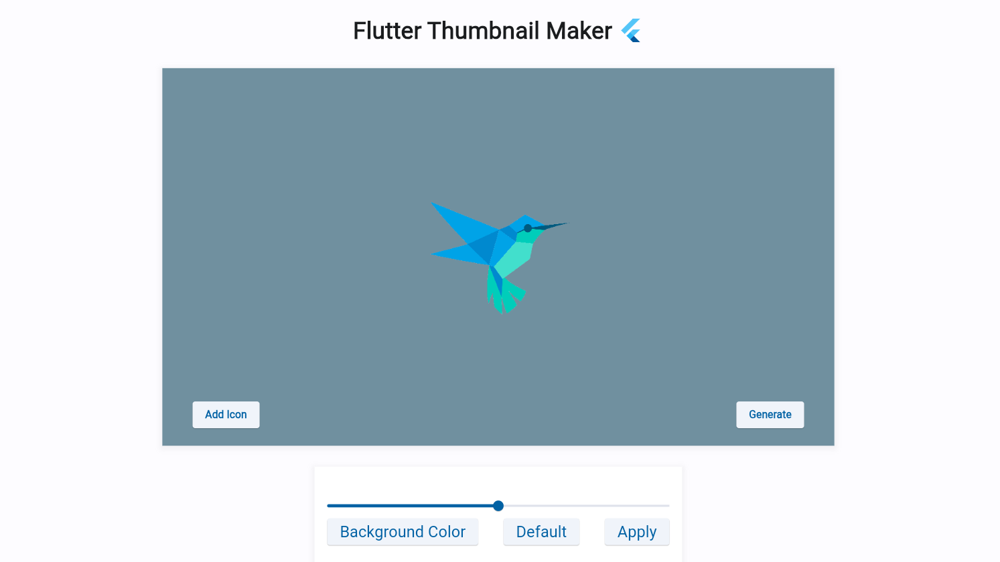

# Flutter Thumbnail Maker

[flutter_thumbnail_maker](https://flutter-thumbnail-maker.web.app/)

# ****Introduction****

This is a thumbnail maker I made to study flutter. It is a site for generating thumbnails for YouTube, blogs, etc. It is a website that allows you to set an image in the center of the screen and a surrounding background color that matches the image, and then export it as a png. Later, it will support adding text and various layouts and resolutions.

## **References**

[Create Beautiful Thumbnails For Vivaldi's Speed Dials](https://vivaldi-thumbnails.netlify.app/)

## To-do Features

- [x]  Import icon from local file
- [x]  Icon-based color palettes
- [x]  Importing icons from image URL
- [ ]  Add Text
- [ ]  Setting resolution & layout
- [ ]  Searching icons from no copyright
